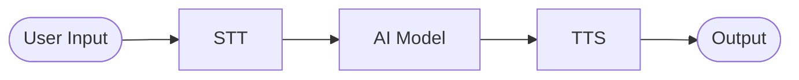
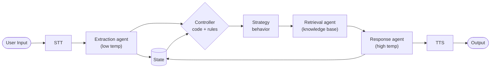

The goal of this project is to take what I learned from the previous AI voice bot project and redo my approach from the ground up as a result of my findings.

## Previous Architecture

**Positives:**
- Low cost — free to run local open source model

**Limitations:**
- Lacked reasoning ability
- Poor sales agent performance
- Unable to support business operations

## Hypothesis

New architecture will be more effective by creating a deterministic workflow that separates tasks and reduces scope for lightweight AI models.

## Operations

Each pipeline stage has a distinct responsibility. The model is instantiated once by the Factory and configured at runtime by the prompt builder based on the current action and state.

### 1. STT
Raw audio captured by PortAudio is transcribed into text by Whisper.

### 2. Extraction agent
The prompt builder loads `/skills/extraction.md` and assembles a low temperature prompt. The model extracts structured JSON from the transcript — intent, entities, and any relevant facts.

### 3. State
Extracted JSON is written to state. The controller reads state on every turn to maintain conversation context without relying on model memory.

### 4. Controller
Applies deterministic code and rules against the current state. Returns one of the following ACTION enums:
- `RETRIEVE_KNOWLEDGE` — external data is needed to respond
- `GENERATE_RESPONSE` — enough context exists to respond directly
- `COMPLETE` — conversation turn is finished

### 5. Strategy
Receives the ACTION from the controller and routes the pipeline accordingly — through the retrieval agent or direct to the response agent.

### 6. Retrieval agent
Queries the knowledge base using context from the extracted JSON and current state. Returns relevant data to be injected into the response prompt.

### 7. Response agent
The prompt builder loads `/skills/response.md`, injects retrieved context and current state, and assembles a high temperature prompt. The model generates a natural, TTS-friendly response.

### 8. TTS
The response text is converted to speech by Kokoro and played back via PortAudio.

---

## Skill Files

Each model in the pipeline is configured at runtime via a markdown skill file.

| File | Role |
|------|------|
| `/skills/extraction.md` | JSON schema and field rules for extraction model |
| `/skills/response.md` | Persona, tone, and conversation rules for response model |

## Technologies

| Tool | Role | Language |
|------|------|----------|
| C++ | Pipeline orchestration | C++ |
| llama.cpp | Local model inference | C++ |
| Whisper | STT | Python |
| Kokoro | TTS | Python |
| PortAudio | Microphone / speaker | C++ |
| Makefile | Build system | — |

## Design Patterns

| Pattern | Role |
|---------|------|
| Factory | Single model instantiation point |
| Builder | Runtime prompt assembly per task |
| Controller | Orchestration and action selection |
| Strategy | Module routing based on selected action |
| State | Conversation memory outside model context |

## Current Status

- [x] Architecture design
- [ ] Project structure (in progress)
- [ ] Controller implementation (in progress)
- [ ] State management
- [ ] Model integration

## Next Steps

1. Define project file structure to reflect architecture
2. Implement controller with simulated string outputs to validate design pattern organization
