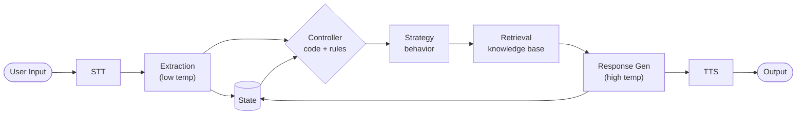

The goal of this project is to take what I learned from the previous AI voice bot project and redo my approach from the ground up as a result of my findings.

## Previous Architecture

**Positives:**
- Low cost — free to run local open source model

**Limitations:**
- Lacked reasoning ability
- Poor sales agent performance
- Unable to support business operations

## Hypothesis

New architecture will be more effective by creating a deterministic workflow that separates tasks and reduces scope for lightweight AI models.

## Technologies

## Technologies

| Tool | Role | Language |
|------|------|----------|
| C++ | Pipeline orchestration | C++ |
| llama.cpp | Local model inference | C++ |
| Whisper | STT | Python |
| Kokoro | TTS | Python |
| PortAudio | Microphone / speaker | C++ |
| Makefile | Build system | — |

## Design Patterns

| Pattern | Role |
|---------|------|
| Factory | Single model instantiation point |
| Builder | Runtime prompt assembly per task |
| Controller | Orchestration and action selection |
| Strategy | Module routing based on selected action |
| State | Conversation memory outside model context |

## Current Status

- [x] Architecture design
- [ ] Project structure (in progress)
- [ ] Controller implementation (in progress)
- [ ] State management
- [ ] Model integration

## Next Steps

1. Define project file structure to reflect architecture
2. Implement controller with simulated string outputs to validate design pattern organization
